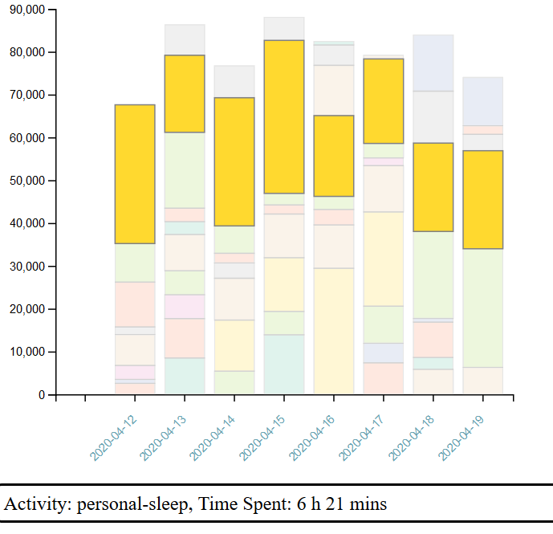
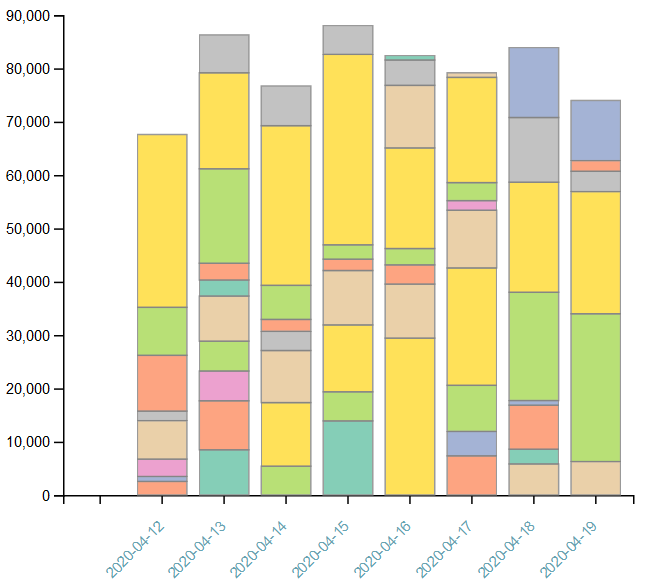

# Watson Charts

## Pre-requisites

1. Install python3.7
1. Install Nodejs-13.10+
1. Install npm

## Install Node packages

Only needed once.

```
npm install
```

## Run Node.js Http Server for the dashboard

```
npm run serve
```

## Check Dashboard

```
http://localhost:8000/
```




## Troubleshooting

### Dump Watson data in CSV

```
watson log --csv > data/watson.csv
```

### Clean data using Python script

```
python3.7 py-scripts/process_watson.py
```


